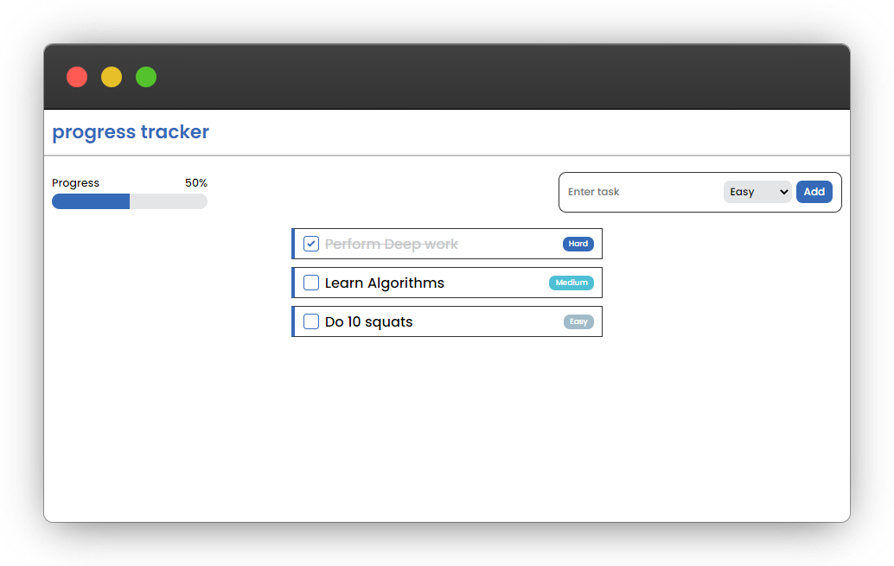

# ⏳ Progress Bar Task Tracker

A web page that has some tasks with a checkbox next to it. Once a task is completed the progress bar will be filled up bit by bit and the percentage that it fills up will be based on the weight of the task.

- For a Hard task it's weight will be 3
- For a Medium task it's weight will be 2
- For an Easy task it's weight will be 1

## Screenshot

## Built with

- HTML
- CSS
- Vanilla JS

## Demo

You can do a quick check [here]()
